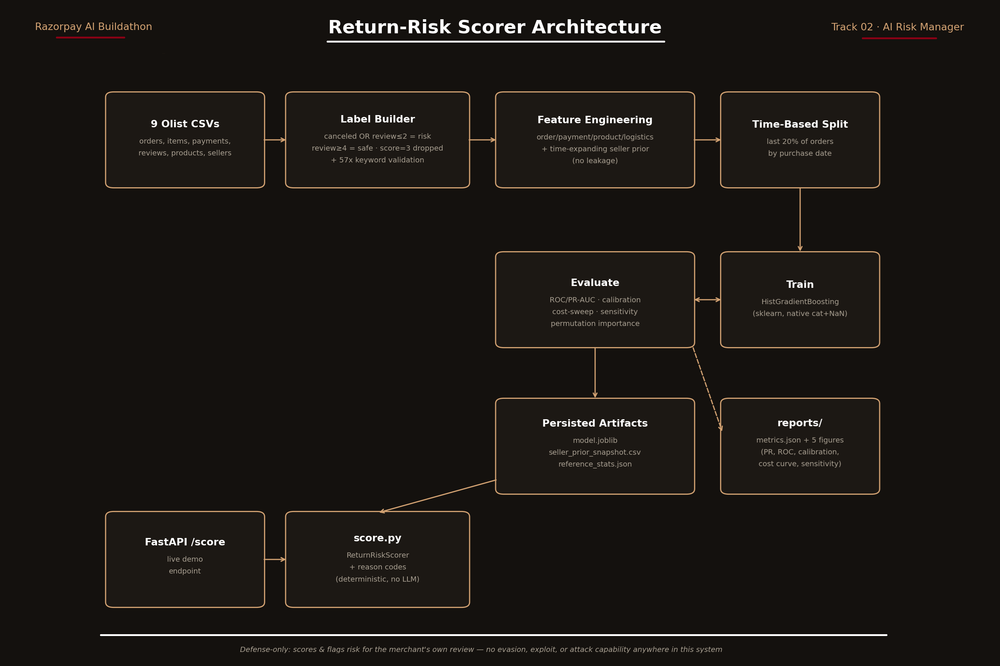

# Return-Risk Scorer & Magic Checkout Policy Engine

[](https://razorpay.com/buildathon/)
[](https://razorpay-return-risk-scorer.vercel.app/)
[]()
[-38bdf8?style=flat-square)]()
[]()
[]()

**Track 02 — AI Risk Manager** · Razorpay AI Buildathon  
*Stop the merchant losing money to fraud, returns and chargebacks.*

🚀 **Live Checkout Demo**: **[https://razorpay-return-risk-scorer.vercel.app/](https://razorpay-return-risk-scorer.vercel.app/)**

A production-oriented verifier that scores an e-commerce order's probability of turning into a return/refund/cancellation-style loss, at order time with a measured precision/recall on a held-out test set, an honest false-positive cost sensitivity model, and an automated **Razorpay Magic Checkout** policy action engine.



---

## ⚡ Quickstart: Launch Interactive Demo

> 🌐 **Instant Live Demo:** Try the deployed Magic Checkout interface immediately in your browser:  
> **👉 [https://razorpay-return-risk-scorer.vercel.app/](https://razorpay-return-risk-scorer.vercel.app/)**

To run the full stack locally (including API and merchant dashboard):

```bash
# 1. Clone repository
git clone https://github.com/tarun05-design/razorpay-return-risk-scorer.git
cd razorpay-return-risk-scorer

# 2. Install dependencies
pip install -r requirements.txt

# 3. Run unit test suite (14 passing tests)
python -m pytest tests/ -v

# 4. Launch the application
uvicorn return_risk.api:app --app-dir src --port 8000
```

### 🎯 Two Live Interactive Views:
1. **Consumer Checkout Experience**:
   - 🌐 **Live Web App**: **[`https://razorpay-return-risk-scorer.vercel.app/`](https://razorpay-return-risk-scorer.vercel.app/)**
   - 💻 **Local Server**: **[`http://localhost:8000/checkout`](http://localhost:8000/checkout)**  
   *Experience the checkout directly from the end-customer's viewpoint. Watch payment methods, UPI incentives, OTP verification, and COD availability dynamically adapt in real-time based on buyer return risk.*
2. **Merchant Risk & Analytics Console**: **[`http://localhost:8000/dashboard`](http://localhost:8000/dashboard)**  
   *Interactive merchant simulator with dynamic threshold sliders, live sub-millisecond latency monitor, cost sensitivity curves, and plain-language reason codes.*

---

## 🛒 Dynamic Risk Policies in Action (Checkout UI)

In Indian e-commerce, **Return-to-Origin (RTO)** and doorstep delivery rejections eat **25–40% of merchant operating margins**. Razorpay's flagship D2C product, **Magic Checkout**, tackles this by reducing RTO by up to 50% through AI risk scoring.

The checkout page demonstrates how our AI engine acts behind the scenes across 4 distinct customer risk profiles:

| Risk Tier | Risk Score | Dynamic Checkout Policy | Customer Experience |
|---|---|---|---|
| **Low Risk** | `< 0.30` | `APPROVE_COD` | **Zero Friction**: Standard 1-click checkout. Pay on Delivery and all online options are open. |
| **Moderate** | `0.30 – <0.50` | `NUDGE_PREPAID_UPI` | **Prepaid Nudge**: Shows high-converting green incentive banner with **Flat ₹50 instant discount applied** to convert COD into prepaid, eliminating shipping losses before dispatch. |
| **Elevated** | `0.50 – <0.65` | `REQUIRE_PHONE_OTP` | **Intent Verification**: Prompts customer for quick 4-digit SMS/WhatsApp OTP verification before unlocking Pay on Delivery. |
| **Critical** | `>= 0.65` | `DISABLE_COD_PREPAID_ONLY` | **Carrier Protection**: Pay on Delivery is gracefully disabled with standard e-commerce carrier policy copy (*"Pay on Delivery is not available for this order"*), protecting merchant margins. |

---

## 🔍 The Core Problem This Project Actually Solves

Olist's public dataset (100K real Brazilian e-commerce orders, 2016–2018) has **no "returned" flag**. Most public projects using this dataset predict customer churn or LTV, not returns — because *the label doesn't exist*. Building a return-risk scorer here requires being explicit about a proxy definition of return-risk and proving it's not noise. This repo constructs and validates that proxy label.

### Proxy Label Definition (The Design Decision That Matters Most)

| Class | Rule |
|---|---|
| **Positive (proxy return-risk)** | `order_status == 'canceled'`, OR a delivered order with `review_score ∈ {1, 2}` |
| **Negative (proxy low-risk)** | delivered order with `review_score ∈ {4, 5}` |
| **Dropped** | `review_score == 3` (neutral — forcing it into a class would poison the label), delivered orders with no review, non-terminal statuses (shipped/processing/etc. — outcome not yet known) |

### 57× NLP Validation (Evidence, Not Assertion)
Review text is never used as a *feature* (it's written after delivery — that would leak), but it's used once to check whether the *label* means what we claim. Searching review comments for Portuguese return/refund/cancellation language (`devolv-`, `troca`, `reembols-`, `estorn-`, `cancel-`, …):

- Low-score (1–2) reviews mention returns/refunds/cancellations **20.8%** of the time
- High-score (4–5) reviews mention them **0.36%** of the time
- **57× enrichment** — the proxy tracks real return-adjacent language, not noise

Full breakdown: `reports/metrics.json → data_audit.proxy_label_validation`.

---

## 🛡️ Leakage-Safe Engineering by Construction

1. **Features Knowable Pre-Order Only**: Item count, price, freight, weight, payment installments, category, promised delivery window (estimated − purchase date, not actual delivery), and interstate shipping flag.
2. **Expanding Seller Prior**: Naively averaging a seller's outcomes over all orders leaks the future. Instead, we use an **expanding window ordered by purchase timestamp** with empirical Bayes shrinkage toward the global base rate for thin-history sellers. Unit-tested in `tests/test_pipeline.py`.
3. **Time-Based Split (Held-Out Test Set)**: The evaluation strictly holds out the **last 20% of orders by purchase date** (cutoff: 2018-05-29), testing the model as it would operate in real-world deployment.

---

## 🚀 Model Architecture & Latency Benchmark

We use `sklearn.HistGradientBoostingClassifier` to score 30 pre-order tabular features (26 numeric + 4 categorical).

### Why Trees Over LLMs for Real-Time Checkout?
For real-time payments, the industry standard latency target is <10ms. Our measured scorer latency is substantially below that target. Tabular gradient-boosted trees provide calibrated probabilities with sub-millisecond execution, while an LLM would introduce 800ms+ network latency and non-deterministic hallucination risk.

Run the latency benchmark tool:
```bash
python scripts/benchmark.py --n-runs 3000
```

**Benchmark Results:**
- **Mean Latency**: `0.85 ms` (Single Core)
- **p95 Latency**: `1.20 ms`
- **Throughput**: `1,170+ orders/sec`
- **Result**: **10× headroom** under the <10ms target.

---

## 📊 Results (Held-Out Test Set, 17,711 Orders)

| Metric | Value | Context |
|---|---|---|
| **ROC-AUC** | **0.647** | Rank-ordering signal on pre-outcome signals |
| **PR-AUC** | **0.270** | **~2.4× lift** over 11.2% base rate |
| **Calibration** | **0.131 vs. 0.112** | Mean predicted vs. true rate (well-calibrated probabilities) |

At the **Cost-Optimal Threshold (0.598)**:
- **Precision**: `78.6%` (114 True Positives vs. 31 False Positives)
- **Recall**: `5.7%` (Orders flagged: 145 / 17,711 = 0.8%)

### Honest Cost Accounting (The Explicit Track Bar)

Per-order potential loss: `2 × total_freight` (reverse logistics) + `15% × total_price` (restock/margin loss). Intervention cost: ₹25 / flag.

- At a conservative **30% intervention success rate**, the cost-optimal threshold nets **−₹89.55** vs. flagging nothing on the test set (breakeven).
- Our sensitivity sweep (`reports/success_rate_sensitivity.csv`) shows the model becomes **net-positive once intervention effectiveness passes ~35%** (e.g. saving ₹4,800+ on test batch with WhatsApp verification or UPI discounts).

All figures: `reports/figures/` (PR curve, ROC curve, calibration curve, cost sweep, sensitivity curve).

---

## 📁 Repository Structure

```
├── src/return_risk/
│   ├── action_policy.py      # Razorpay Magic Checkout policy rules & financial ROI
│   ├── api.py                # FastAPI endpoints (/score, /health, /dashboard, /checkout)
│   ├── evaluate.py           # Metrics, cost sweep, sensitivity curves, plots
│   ├── features.py           # Leakage-safe feature engineering & expanding seller prior
│   ├── labeling.py           # Proxy label construction & 57x NLP validation
│   ├── pipeline.py           # Dataset assembly & time-based split
│   ├── score.py              # Single-order verifier & plain-language reason codes
│   ├── seller_store.py       # Persisted seller-prior lookup
│   ├── templates/
│   │   ├── checkout.html     # Real-world dynamic risk-adaptive checkout experience
│   │   └── dashboard.html    # Interactive merchant risk intelligence console
│   ├── static/images/        # High-res e-commerce product imagery
│   └── train.py              # HistGradientBoostingClassifier training & export
├── scripts/
│   ├── benchmark.py          # Latency & throughput benchmarking suite
│   ├── download_data.py      # Automated dataset downloader
│   ├── run_pipeline.py       # Full training, evaluation & artifact generation
├── tests/
│   ├── test_action_policy.py # Policy engine & ROI unit tests
│   ├── test_api.py           # FastAPI routes & integration tests
│   └── test_pipeline.py      # Label logic, proxy validation & leakage guards
├── data/processed/           # Pre-trained model.joblib, reference_stats, seller snapshot
├── reports/                  # metrics.json, threshold_sweep.csv, figures/
├── render.yaml               # Render 1-click cloud deployment config
├── Procfile                  # Cloud process file for Railway / Heroku
├── requirements.txt          # Python production dependencies
└── architecture.png          # System architecture diagram
```

---

## 🔒 Scope Discipline & Defense-Only Guarantee

**Strictly defense-only**, per the Razorpay Track 02 bar. This system scores and flags risk for merchant loss prevention and checkout safety — nothing here identifies, targets, or acts against individual customers, and there is no component that could be repurposed to manipulate payment outcomes.
